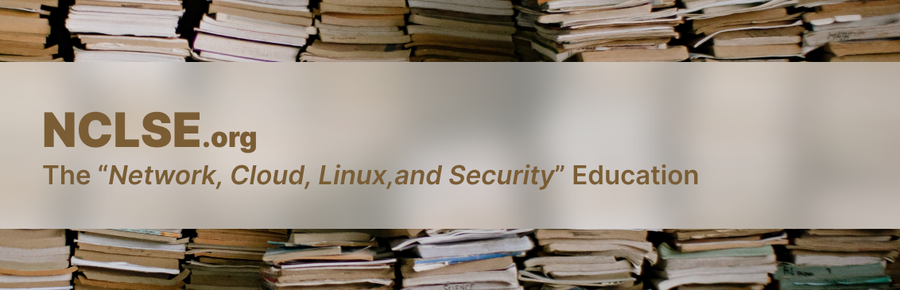

## Preface
NCLSE was originally named _Netamiral_. However, due to being shorter and easier to remember, the name was changed to NCLSE which stands for **Network, Cloud, Linux, and Security Education**. However, even though the name of this organization is taken from several scopes in the IT Operations field, in the future it is possible that there will be material related to programming and other IT fields.

## Our Principles
"Open Source and Free for Everyone IT Resources and Materials"

## Contributions
Everyone is welcome to contribute, provided they are committed to free and open source technology education. if you wish to contribute to this organization please send an email to [info@nclse.org](mailto:nclse.org)

## Our Social
- [LinkedIn](https://linkedin.com/company/nclse)
- [Email](mailto:info@nclse.org)
